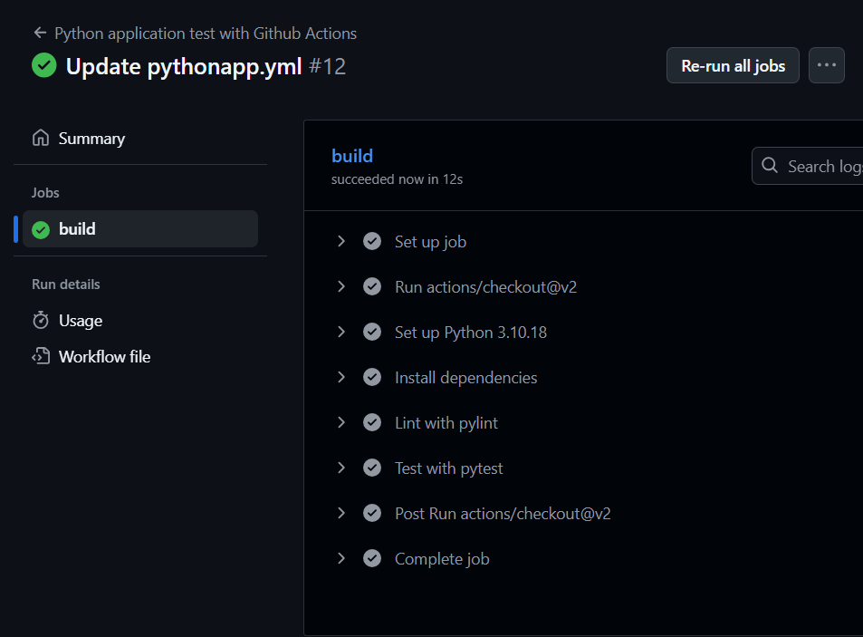

# Overview

In this project, I created a full CI/CD pipeline for a Flask-based machine learning application using:

GitHub Actions for Continuous Integration (CI)

Azure Pipelines for Continuous Delivery (CD)

Azure App Service for hosting the app

The project includes:

Automated linting, testing, and packaging

Deployment to Azure on every code change

A Makefile and Bash scripts for reproducible workflow

### Architecture CI/CD Workflow:
Developer pushes code to GitHub.

GitHub Actions runs make all (install → lint → test).

If CI passes, Azure Pipelines builds and deploys the app to Azure App Service.

## Project Plan

the board: https://trello.com/b/6Gux9cPM/udacity
the file: https://docs.google.com/spreadsheets/d/1pOmuhYMsWYRNB8kvIdr9X0hpKFXW3Ah6EVeq03g6uTw/edit?usp=sharing

## Create GitHub Actions Workflow
Go to your GitHub Repo
Got to Actions
Go to 'New workflow' and 'set up a new workflow yourself'
Configure your YML file as such:
name: Python application test with Github Actions

on: [push]

jobs:
  build:

    runs-on: ubuntu-latest

    steps:
    - uses: actions/checkout@v2
    - name: Set up Python 3.10.18
      uses: actions/setup-python@v1
      with:
        python-version: 3.10.18
    - name: Install dependencies
      run: |
        make install
    - name: Lint with pylint
      run: |
        make lint
    - name: Test with pytest
      run: |
        make test
Verify your successfull run in 'All Workflows'
A prerequisite for having a successfull CI workflow in GitHub Actions is a 'Makefile' and a 'requirements.txt'. In this project, I will only use pylint for code testing, not pytest. In the requirements file, you need to state the python libraries that are needed to get the Flask web app running. With this in place, a new push to the GitHub repo will automatically trigger the CI workflow in GitHub Actions (testing the app.py file). A pylint score below 10 will result in a failed CI build. That's the sign to refactor your code according to the pylint standards.

## Instructions
### Architectural Diagram 
Description:
diagram shows how the Flask ML application interacts with Azure services:

Code stored in GitHub

Azure DevOps Pipelines pull and deploy to Azure App Service

Flask app exposes /predict endpoint for ML predictions

User or other systems send data to the deployed app for inference

### 1.Clone the Project into Azure Cloud Shell 
Open your Azure Cloud Shell and run:
first Generate SSH Key (if needed)
'''
ssh-keygen -t rsa -b 4096 -C "xmiss.reem@gmail.com"
'''
use your email
Display Public SSH Key to Add to GitHub
'''
cat ~/.ssh/id_rsa.pub
'''
copy the output to your github as a new ssh key

https://github.com/Reem8534/azure102.3/blob/main/screenshots/Screenshot%202025-08-08%20215107.png

'''
git clone git@github.com:Reem8534/Azure102.3.git
cd Azure102.3
'''
like this 
https://github.com/Reem8534/azure102.3/blob/main/screenshots/Screenshot%202025-08-08%20215804.png

### 2. Set Up Python Virtual Environment and Install Dependencies
Create and activate a Python virtual environment:

'''
python3 -m venv ~/.udacity-devops
source ~/.udacity-devops/bin/activate
'''
you will notice the change in the cml like this 
https://github.com/Reem8534/azure102.3/blob/main/screenshots/Screenshot%202025-08-08%20220131.png

### Install required Python packages:
'''
pip install --upgrade pip
pip install -r requirements.txt
'''

### 3. Run Code Quality Checks and Tests
Run linting to check code quality:
'''
pylint --disable=R,C,W1203 app.py
Run all tests with:
'''
make all
'''
All tests should pass successfully.

### 4. Run the Flask Application Locally
Start the Flask app by running:
'''
python app.py
'''
The app will run locally at:

## http://127.0.0.1:5000
You can test API endpoints or view logs in the terminal.
https://github.com/Reem8534/azure102.3/blob/main/screenshots/Screenshot%202025-08-08%20220928.png
https://github.com/Reem8534/azure102.3/blob/main/screenshots/Screenshot%202025-08-08%20220947.png

### 6. Verify Prediction from LOCAL App
Run the prediction script to test the deployed model:
'''
./make_prediction.sh
'''
{"prediction":[2.43157479005745]}
https://github.com/Reem8534/azure102.3/blob/main/screenshots/Screenshot%202025-08-08%20221326.png
### 5. Deploy to Azure App Service
Deploy your Flask app to Azure using Azure CLI:

'''
az webapp up --name azureappreem --resource-group Azuredevops
'''
Wait for the deployment to complete. The CLI will output your app URL, for example:

### http://azureappreem-eehua9esfaa5awaf.canadacentral-01.azurewebsites.net
Open this URL in a browser to verify the app is running.
https://github.com/Reem8534/azure102.3/blob/main/screenshots/Screenshot%202025-08-08%20224747.png
https://github.com/Reem8534/azure102.3/blob/main/screenshots/Screenshot%202025-08-08%20225745.png
Create a new project in Azure DevOps

Create a new service connection in Azure DevOps (you can find it under project settings). The Azure Resource Manager comes in handy for that. Choose Service principal (automatic) if asked and establish a connection to your subscription and resource group.

Go to Azure DevOps Pipelines and create one by connecting it to your GitHub repo. Once, you can configure your pipeline, choose 'Python to Linux Web App on Azure'. This will generate the appropriate YML file for the Flask web app.
Once, this step is successfully done, you have deployed the Flask Web App.

[Screenshot 2025-08-08 022820
](https://github.com/Reem8534/azure102.3/blob/main/screenshots/Screenshot%202025-08-08%20022820.png)

### 6. Verify Prediction from Deployed App
Run the prediction script to test the deployed model but first change the link in the file to be the link you are deployinghere 
https://github.com/Reem8534/azure102.3/blob/main/screenshots/Screenshot%202025-08-08%20224834.png
'''
./make_predict_azure_app.sh
'''
{"prediction":[2.43157479005745]}
https://github.com/Reem8534/azure102.3/blob/main/screenshots/Screenshot%202025-08-08%20225301.png
### 7. View Live Logs from Azure App Service (Optional)
To stream logs and troubleshoot, run:

'''
az webapp log tail --resource-group Azuredevops --name azureappreem
'''
This shows live logs of your deployed Flask app.
https://github.com/Reem8534/azure102.3/blob/main/screenshots/Screenshot%202025-08-08%20225517.png

## Enhancements

Add automated integration tests to cover the Flask app API endpoints.

Implement Azure Key Vault for managing secrets and credentials securely.

Use Azure Blob Storage to store models and enable dynamic model loading.

Add Azure Application Insights for detailed telemetry and performance monitoring.

Containerize the Flask app using Docker and deploy to Azure Kubernetes Service for better scalability.
## Demo 

[<TODO: Add link Screencast on YouTube>
](https://youtu.be/RrzEMG9Vz10)

